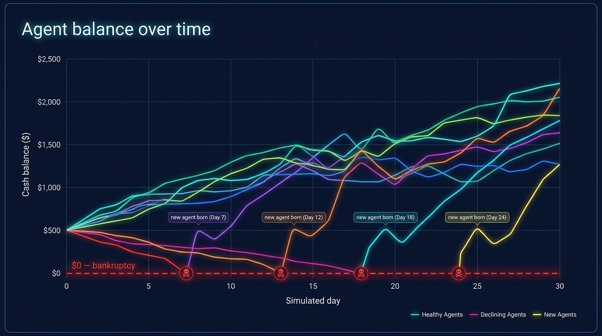
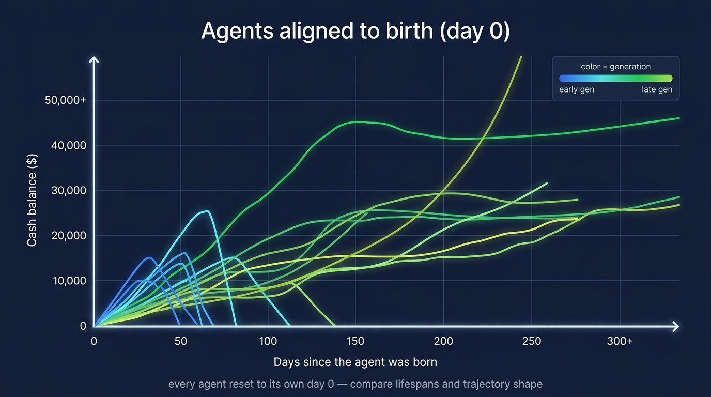
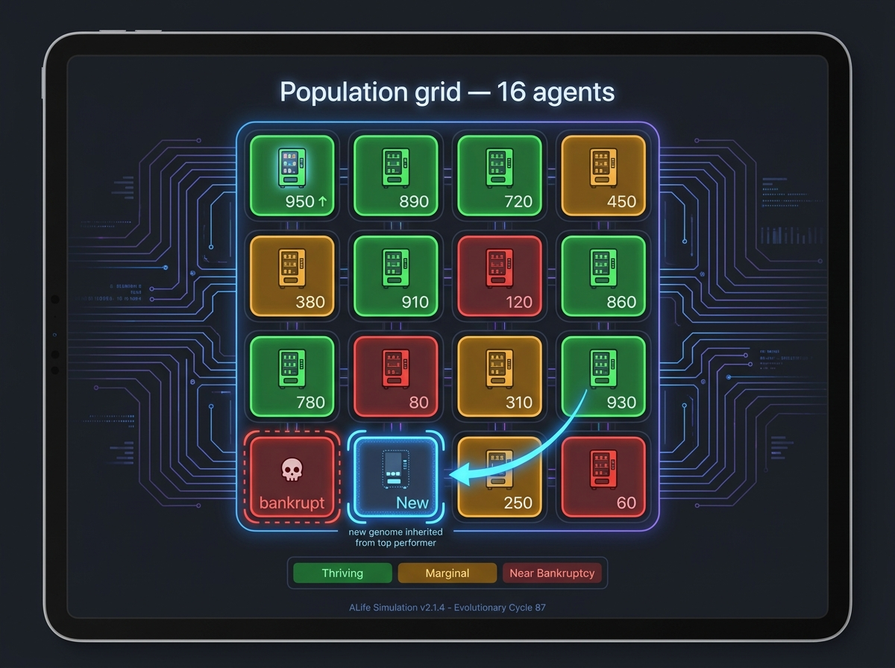

# VendingSurvival Leaderboard — the three views that matter

The leaderboard has to tell the **story of the run**: a population of agents competing to
stay solvent, dying when they can't, and being replaced by *evolved* offspring. Three views
carry that whole story — outcome, learning, and mechanism.

(Concept mockups below generated with Gemini "Nano Banana Pro" — they illustrate the *idea*,
not real data.)

---

## 1. Balance over time (wall-clock)

- **What:** one line per agent — x = simulated day (the run's wall-clock), y = **cash balance**,
  the survival-relevant quantity (balance → `$0` = death). A red `$0 — bankruptcy` floor.
- **Why it's view #1:** balance-over-time *is* the survival signal. At a glance you see who's
  thriving, who's bleeding toward the floor, and the population's overall health.
- **The key detail — births land mid-chart:** because the GA replaces dead agents, a new
  agent's line **begins partway across the chart** (at its birth day, "in the middle"), not at
  the left edge. So the chart shows a *living, churning* population — lines ending at `$0`
  (deaths, ☠) and new lines sprouting mid-timeline (`new agent born`).

## 2. Lifespan-aligned — every agent starts at its own day 0

- **What:** the same balance curves, but each agent's clock is **reset to its birth** — all
  curves overlaid starting at `x = 0` ("days since the agent was born"), of different lengths
  (different lifespans).
- **Why:** view #1 mixes *when you were born* with *how you did*. Aligning to birth lets you
  compare **trajectory shape** and **lifespan** fairly. Color = **generation**: early-gen curves
  (blue) tend to rise then collapse early; later-gen curves (green) extend further and higher.
- **This is the "is evolution working?" view** — if the GA helps, later cohorts' curves should
  outlive and outclimb earlier ones.

## 3. The 4×4 population grid — the ALife view

- **What:** the 16 agents as a **4×4 grid**; each tile color-coded by live performance —
  **green** (thriving), **amber** (marginal), **red** (near bankruptcy) — with its current balance.
- **Death + birth (the lineage):** when an agent goes bankrupt its tile shows a **death marker
  (☠)** and then **re-seeds** — a glowing **arrow points from a top-performing tile to the
  newly-born one**, showing *where the new genome came from* (the GA's selection + crossover).
- **Why:** this makes the **evolution** visible and visceral — selection (the fit reproduce),
  death (the unfit are pruned), inheritance (offspring carry a parent's genome). It's the proof
  that this is a *living, evolving system*, not just a metrics table. Animated over time, tiles
  flip color, die, and get repopulated by arrows from the survivors.

---

## Why these three

| view | answers | role |
|---|---|---|
| **1. Balance over time** | who's surviving / failing, right now | the **outcome** (headline) |
| **2. Lifespan-aligned** | is each new generation surviving longer? | the **learning signal** (is the GA working) |
| **3. Population grid** | who died, who reproduced, whose genome won | the **mechanism** (the ALife story) |

Together: #1 is the *score*, #2 is the *proof of improvement*, #3 is the *story of selection*.
The grid (#3) is what differentiates this from a plain RL leaderboard — it shows agents *being
born from winners and pruned when they die*, in real time.
